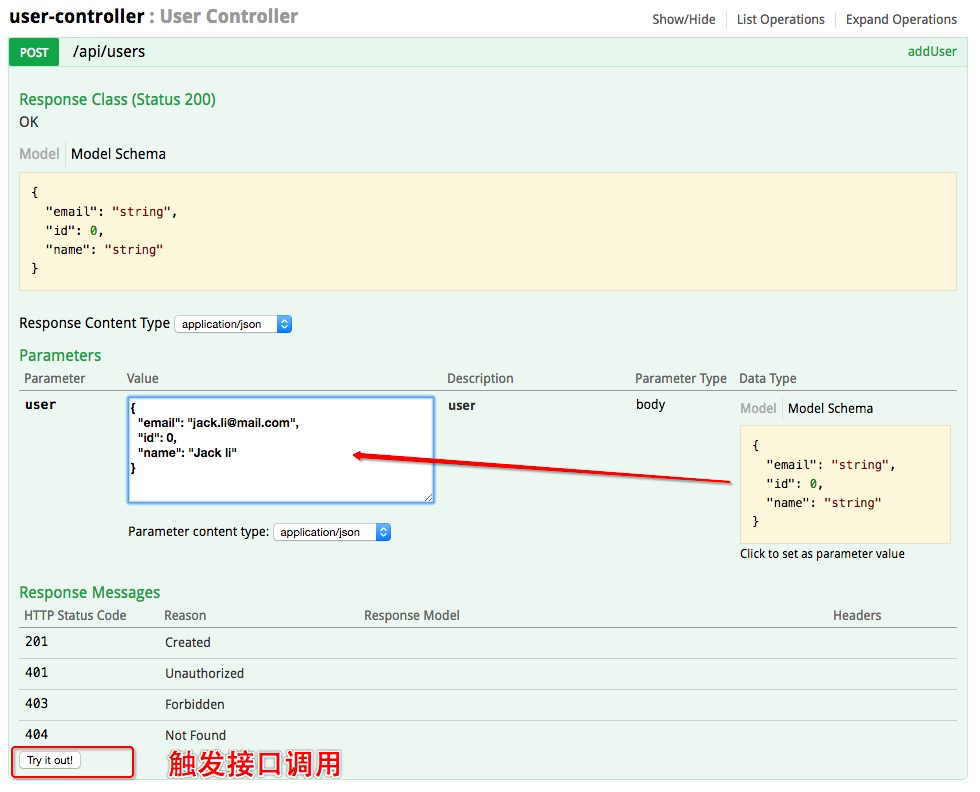
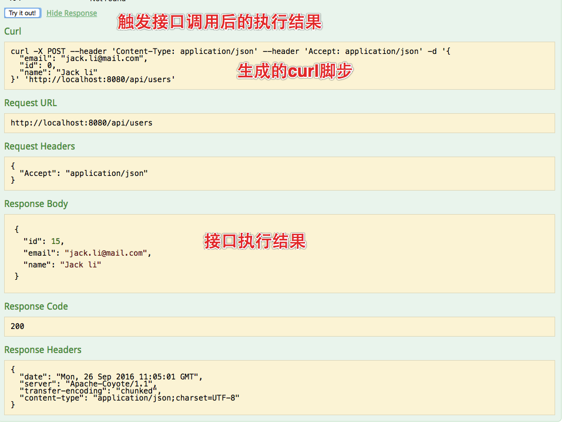
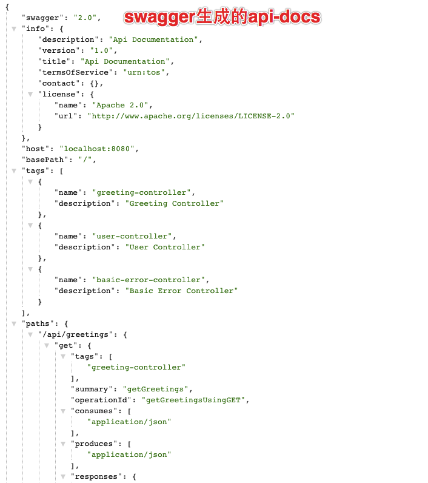
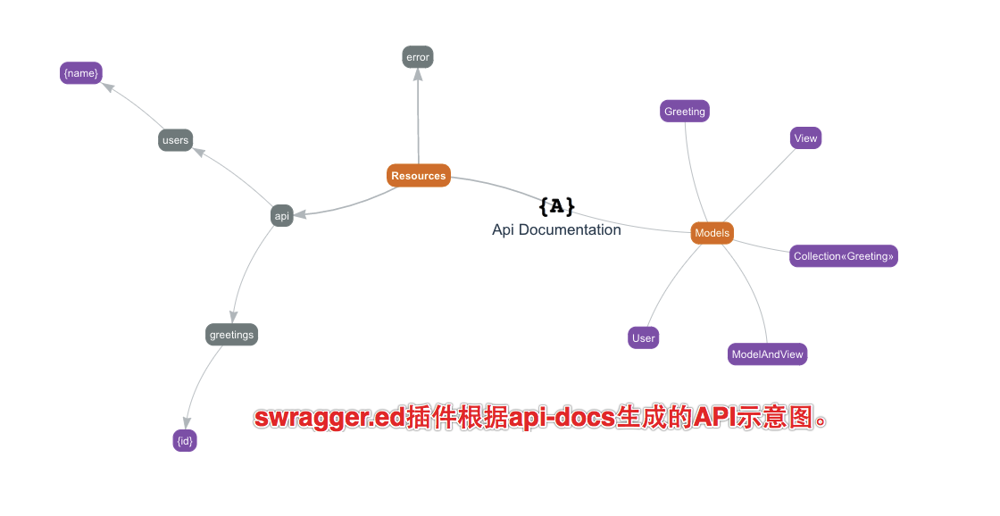

# oss-lib-swagger

## Indroduction

  通过引入oss-lib-swagger自动生成RESTful的api的接口文档,出于安全的考虑生成环境(production)暂不生成api文档。

## 使用方式

  直接在spring boot工程中添加依赖,在非production发布时会生成对应的文档。
  1. 添加依赖
  2. 部署应用
  3. 访问swagger-ui: http://127.0.0.1:8080:8080/swagger-ui.html
      接口说明文档
      
      swagger-ui交互请求结果
          
  4. 访问api-docs: http://127.0.0.1:8080:8080/v2/api-docs
      api-docks
      
      swagger.ed插件示意图
      

## 依赖

```
    <dependency>
        <groupId>com.yirendai.infra</groupId>
        <artifactId>oss-lib-swagger-spring-boot-${spring-boot.version}</artifactId>
    </dependency>
```

application.yml:

    springfox.documentation.swagger.v1.path: '/api-docs'
    springfox.documentation.swagger.v2.path: '/v2/api-docs'

> NOTES:如果项目开启了自定义的SpringMVC，即`@EnableWebMvc`，需要配置指定swagger-ui.html的路径，如下：

    @Configuration
    @EnableWebMvc
    public class WebMvcConfiguration extends WebMvcConfigurerAdapter {
    
        @Override
        public void addResourceHandlers(ResourceHandlerRegistry registry) {
            registry.addResourceHandler("swagger-ui.html").addResourceLocations("classpath:/META-INF/resources/");
            registry.addResourceHandler("/webjars/**").addResourceLocations("classpath:/META-INF/resources/webjars/");
            super.addResourceHandlers(registry);
        }
    
    }
## 参考文档

[official docs](http://springfox.github.io/springfox/docs/current/)

[swagger-editor](http://editor.swagger.io)
[springfox-plugin-for-adding-auth-params](http://mvpotter.com/post/2016/10/springfox-plugin-for-adding-auth-params/)

[usage-of-swagger-2-0-in-spring-boot-applications-to-document-apis](http://heidloff.net/article/usage-of-swagger-2-0-in-spring-boot-applications-to-document-apis/)

[Could it work without RequestMapping annotations? #511](https://github.com/springfox/springfox/issues/511)
[Ability to add custom ApiDescriptions not described via request mappings #1335](https://github.com/springfox/springfox/issues/1335)
